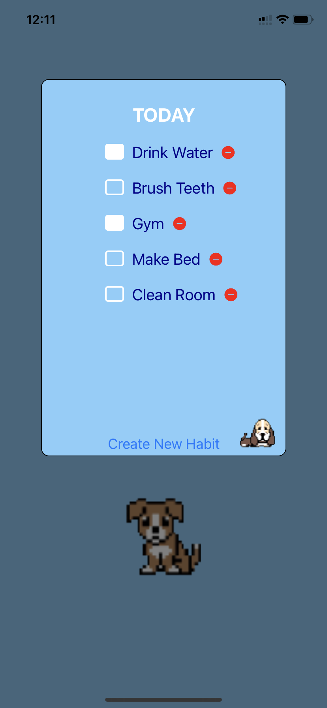
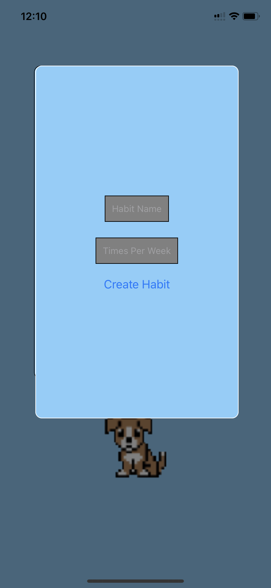
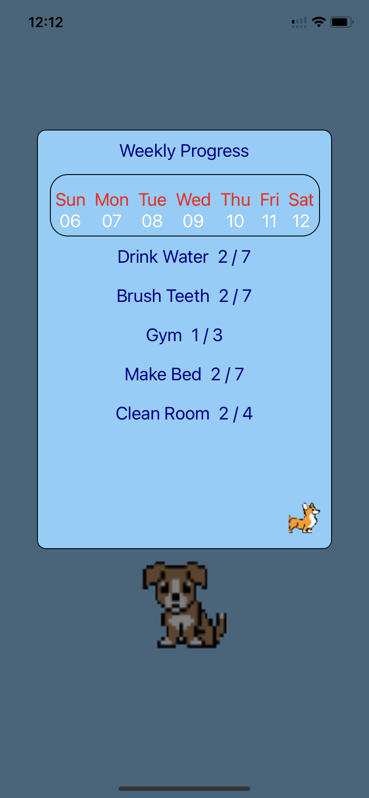
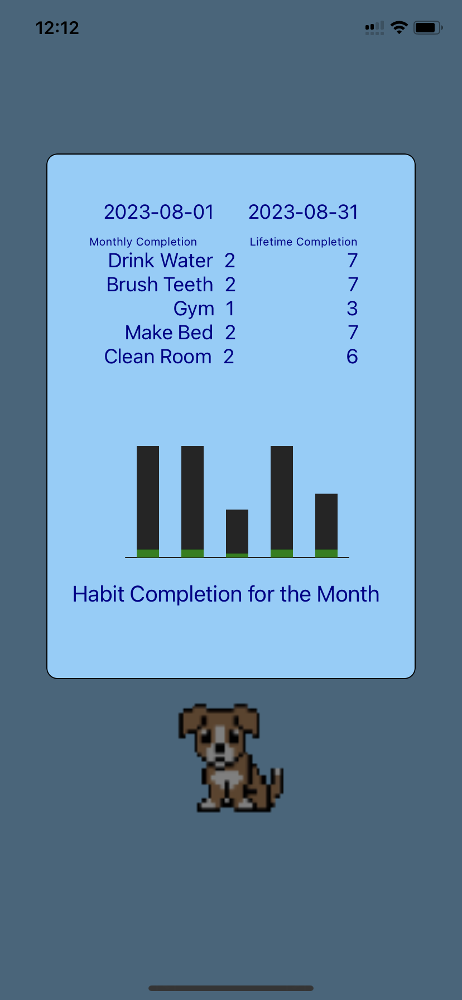

#Habit Hound

##Description

Habit Hound is a mobile app designed to help users build and maintain good daily habits. With features to track daily, weekly, monthly, and lifetime habit progression, Habit Hound keeps users motivated on their journey to self-improvement. The app utilizes Expo SQlite 

database tables and queries to store and manage habit data efficiently. To provide users with clear insights into their monthly habit progress, the app incorporates visually appealing data visualizations using Victory-Native. 

Moreover, Habit Hound ensures a seamless cross-platform experience, running smoothly on both iOS and Android devices thanks to React-Native and Expo.

##Features

Track daily, weekly, monthly, and lifetime habit progress.

Visualize habit progress with clear charts.

Seamlessly run on both iOS and Android devices.

Store and manage habit data efficiently with Expo SQlite.

Keep users motivated to build and maintain good habits.

##Screenshots

##Technologies Used

TypeScript

React-Native

Expo

Expo SQlite

Victory-Native

Tyler Niemann

## License

This project is licensed under the MIT License - see the LICENSE file for details.
